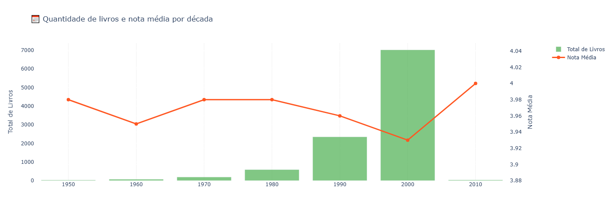
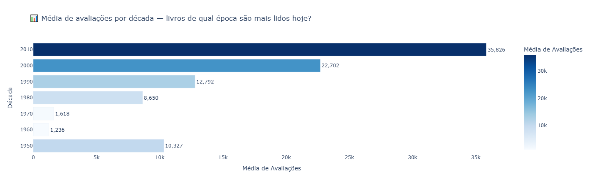
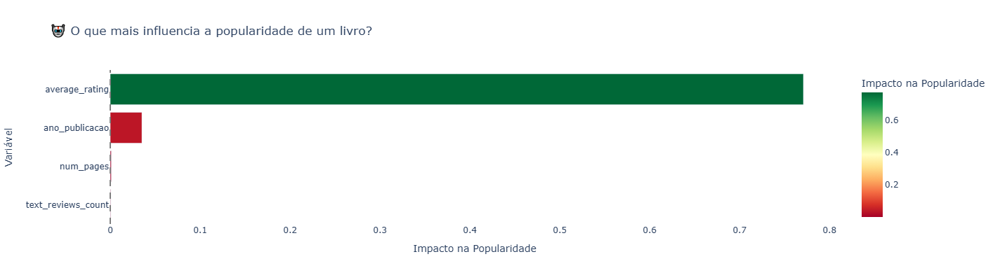
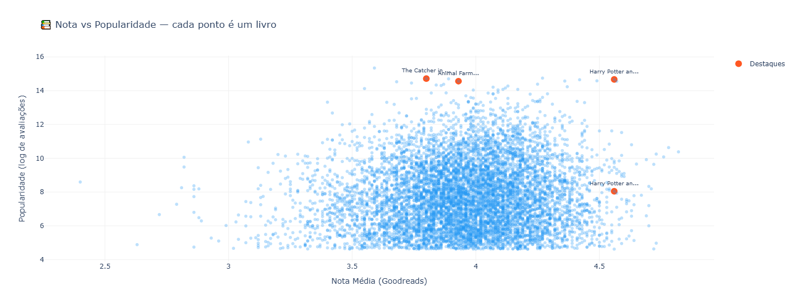
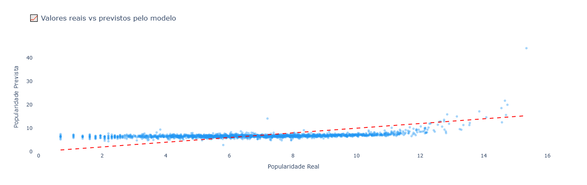

# 📚 O que 10.000 livros do Goodreads revelam sobre gosto literário — e preconceito

> Usei Python, SQL e regressão linear pra analisar 10.395 livros. O que encontrei confirmou o que muitas leitoras já sabiam.

## 🎯 Motivação

Todo mundo tem uma opinião sobre o que é um "bom livro". A crítica literária tem a dela. O algoritmo do Goodreads tem a dele. E as milhões de leitoras que consomem romance e romantasy têm a delas.

Resolvi parar de discutir achismo e fui olhar os dados.

## 📊 O que foi analisado

Analisei 10.395 livros do dataset público do Goodreads, cruzando quatro métricas principais:

| Métrica | Descrição |
|---|---|
| `average_rating` | Nota média do livro no Goodreads |
| `ratings_count` | Total de avaliações recebidas |
| `num_pages` | Número de páginas |
| `ano_publicacao` | Ano de publicação |

## 🔍 Principais descobertas

- Nota não prevê popularidade — o modelo de regressão explica apenas 17.9% da variação
- Twilight tem 4.5 milhões de avaliações e nota 3.59 — o outlier mais extremo do dataset
- Livros dos anos 2010 têm em média 35.826 avaliações — quase o dobro dos anos 2000
- Os livros que o modelo menos consegue prever são exatamente os mais populares entre mulheres

## 📈 Gráficos gerados

## 🛠️ Tecnologias utilizadas

- **Python** — linguagem principal
- **Pandas** — manipulação e limpeza dos dados
- **Plotly** — visualizações interativas
- **SQLite** — banco de dados e queries SQL
- **scikit-learn** — modelo de regressão linear
- **Google Colab** — ambiente de desenvolvimento

## 📝 Artigo completo

O estudo completo com análise e conclusões está publicado no Medium:

[🔗 Leia o artigo completo aqui](https://medium.com/p/26d285863fd3)

## 📁 Arquivos

- [`Goodreads.ipynb`](Goodreads.ipynb) — notebook completo com todo o código
